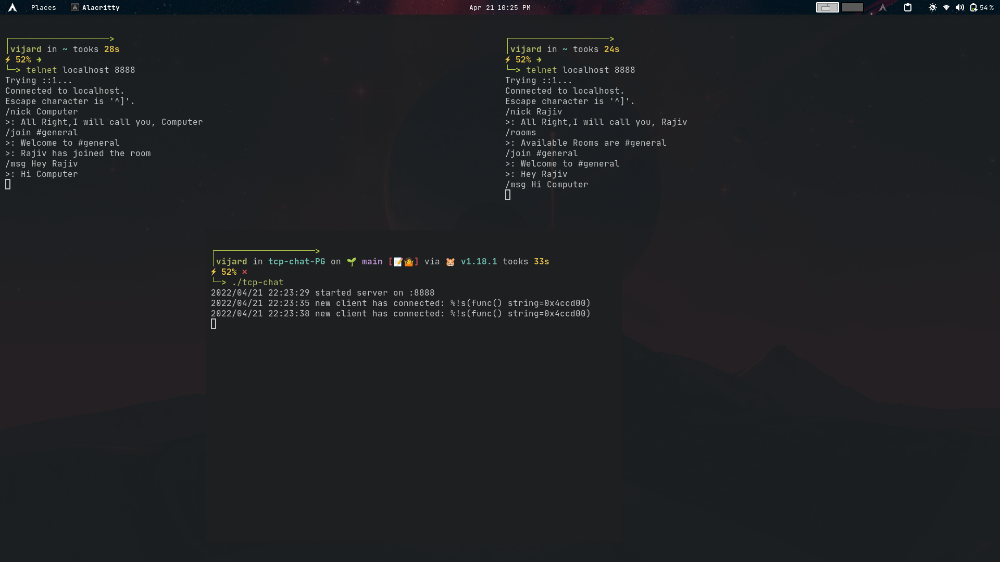

# TCP Chat

A simple Playground to learn tcp chat using Go and TCP connections. 


## Screenshots




## Installation

```bash
 go build .
 ./tcp-chat
```
    
## Usage/Examples

```javascript
telnet localhost 8888

/nick {NAME}     -> To set your username (default:anonymous)
/join {ROOMNAME} -> Join a particular Room , creates if doesnt exist
/rooms           -> Shows all the Existings rooms
/msg {Message}   -> To send a message in Room
/quit            -> Leave a Room
```


## Tech Stack

**Server:** GoLang


## Roadmap

Am planning to extend this to a lot of features in the next 4 months , and use this fully functional on the Raspberry Pi running the DC Hub at my IIT Kgp Campus.

#### Some features that I currently have on mind

- [ ]  Add a database support
- [ ]  Password Protected Rooms
- [ ]  Better Formatting of Output

Can surely Send a PR for any Contributions :smile:

